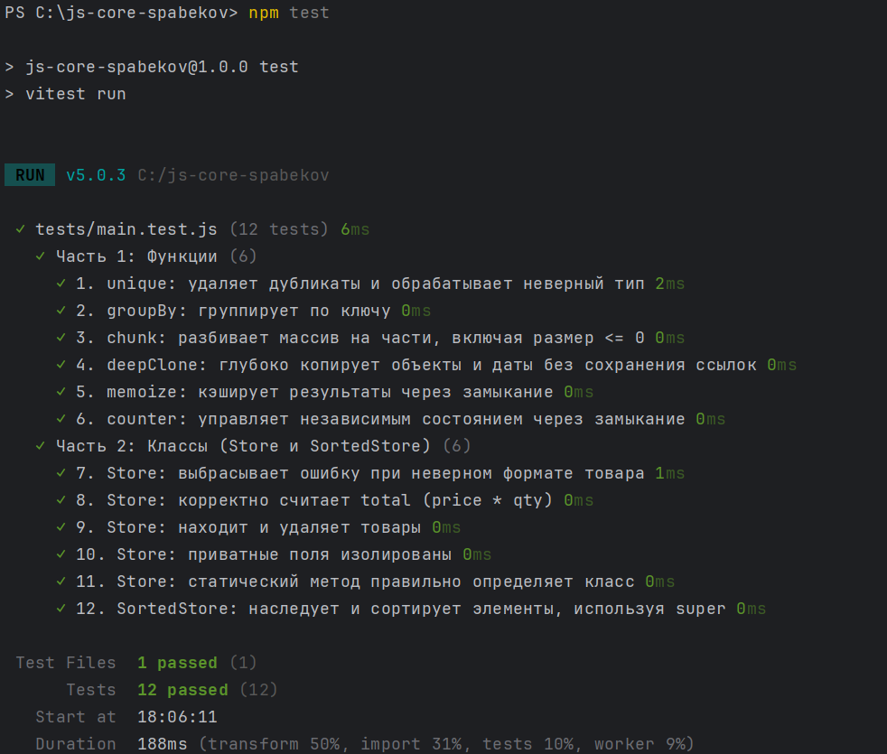

# Lab 4: JS Core
**Author:** Meirbek Spabekov

## 1. How to Run Tests
To install dependencies and run the Vitest test suite, use the following commands:

    npm install
    npm test

## 2. Implemented Features

### Core Functions
* `unique(arr)`: Removes duplicate values from an array. It returns `[]` for non-array inputs.
* `groupBy(arr, keyFn)`: Groups items by a dynamically calculated key. It returns `{}` for invalid inputs.
* `chunk(arr, size)`: Divides an array into smaller chunks of a specific size. It returns `[]` if the size is `<= 0`.
* `deepClone(obj)`: Creates a deep copy of objects, arrays, and Dates, safely cloning nested references.
* `memoize(fn)`: Caches function results using closures, returning cached results on repeated arguments.
* `counter()`: A factory function that creates a private counter and encapsulates state securely.

### Classes
* `Store`: Manages items containing a name, price, and quantity. It features a private field `#items`, methods for `add()`, `remove()`, `find()`, a `total` getter, and a static method `isStore()`.
* `SortedStore`: Extends `Store` and overrides the `items` getter using `super.items` to sort items by price in ascending order.

## 3. Closures in my code
I utilized closures in two functions: `memoize` and `counter`. A closure is a function's ability to remember the lexical environment in which it was created, even after the outer function has finished executing. In the `counter` function, the `count` variable is hidden from direct external access. However, the returned methods `inc`, `dec`, and `value` permanently retain access to it, creating a reliable private state for each new counter instance. Similarly, in the `memoize` function, a closure is used to preserve the `cache` (Map) object. The returned anonymous function has continuous access to this cache across different invocations. This allows it to instantly return previously computed results without exposing the cache object to the global scope.

## 4. Test Results

## 5. AI Tools Used
I used **Gemini** to assist with the project. It helped me design edge cases for the Vitest unit tests (e.g., handling empty arrays, Date objects, and invalid types). I also used it to verify the correct modern syntax for JavaScript private class fields (`#`) and static methods.